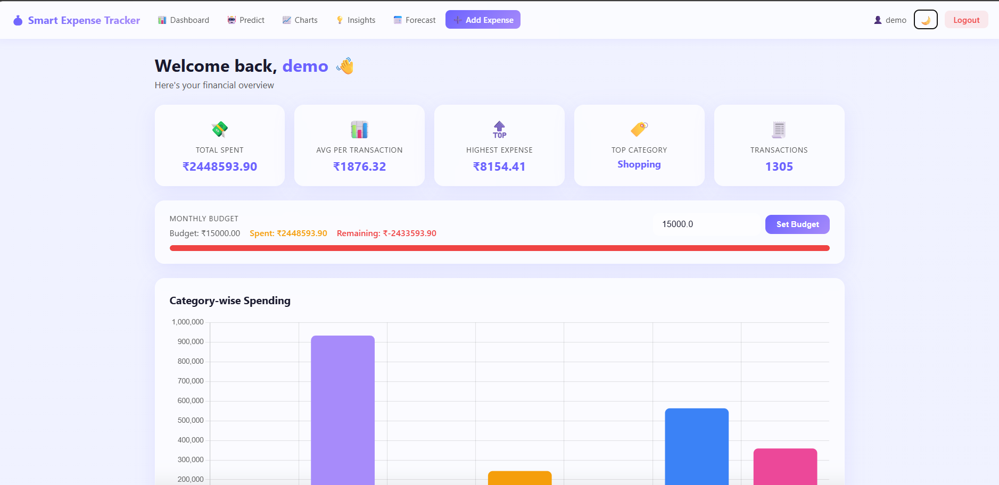
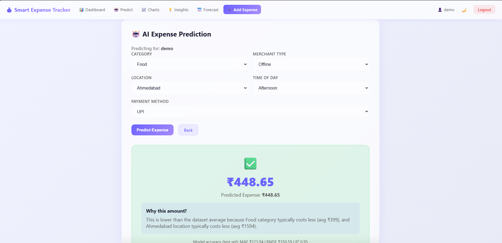
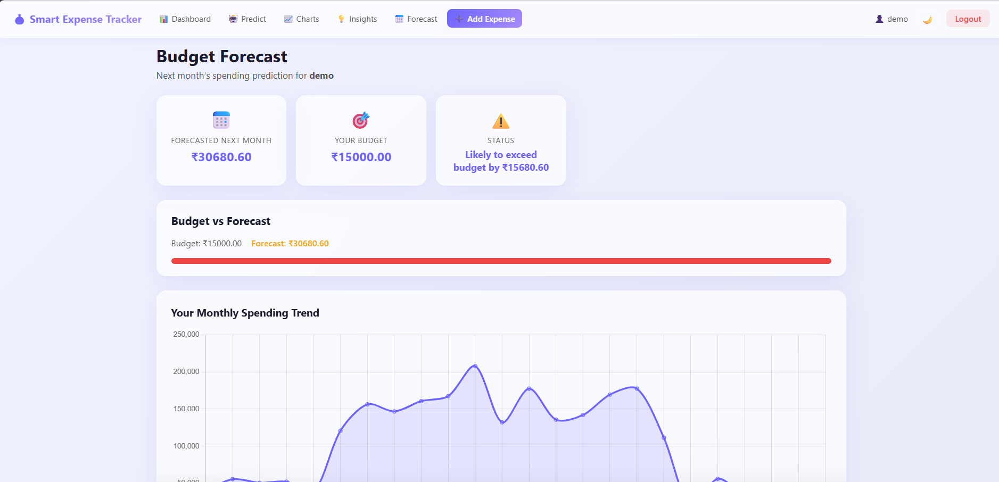

# Smart Expense Tracker

A Flask web application for tracking personal expenses with machine learning-powered predictions, budget forecasting, and spending insights. Built as a full-stack Python project with SQLite, XGBoost, and a modern glassmorphism UI.

## Features

- **User authentication** — Register, login, and manage your own expense history
- **Expense CRUD** — Add, edit, and delete expenses with category, location, payment method, and more
- **Dashboard** — Summary cards, category chart, budget tracking with progress bar
- **AI Prediction** — XGBoost model predicts expense amount with plain-English explanations
- **Budget Forecast** — Trend-based next-month spending forecast vs your budget
- **Insights** — Spending analysis, smart suggestions, and ML model visualizations
- **Charts** — Category and monthly spending charts

## Tech Stack

| Layer         | Technology                           |
| ------------- | ------------------------------------ |
| Backend       | Python, Flask                        |
| Database      | SQLite                               |
| ML            | XGBoost, scikit-learn, pandas, numpy |
| Visualization | matplotlib, Chart.js                 |
| Frontend      | HTML/CSS templates, glassmorphism UI |

## Screenshots

### Dashboard



### Prediction



### Forecast



## ML Approach

The expense prediction model uses **XGBoost regression** to predict transaction **amount** from:

- category, location, payment method, merchant type, time of day, month, day of week

The training dataset (`final_dataset_updated.csv`) is synthetically generated with **realistic, learnable relationships**:

- Travel and Healthcare have higher base amounts than Grocery or Food
- Tier-1 cities (Mumbai, Bangalore, Delhi) cost 15–25% more than Ahmedabad/Pune
- Weekend Entertainment/Food spending is slightly elevated
- Gaussian noise keeps data realistic without breaking patterns

**Proper evaluation:** The model is trained on 80% of data and evaluated **only on a held-out 20% test set** (random_state=42). Metrics saved: MAE, RMSE, R².

## Setup Instructions

### 1. Clone and create virtual environment

```bash
git clone <your-repo-url>
cd azure-project-expense-tracker
python -m venv venv

# Windows
venv\Scripts\activate

# macOS/Linux
source venv/bin/activate
```

### 2. Install dependencies

```bash
pip install -r requirements.txt
```

### 3. Configure environment

```bash
copy .env.example .env   # Windows
# cp .env.example .env   # macOS/Linux
```

Edit `.env` and set a unique `SECRET_KEY`.

### 4. Generate dataset and train model

```bash
python generate_dataset.py
python train_model.py
python generate_visuals.py
```

### 5. Initialize database

```bash
python init_db.py
```

This creates `expense_tracker.db` and seeds demo users (`demo`, `student`, `professional` — password same as username).

### 6. Run the app

```bash
python app.py
```

Open **http://localhost:5000** in your browser.

## Project Structure

```
├── app.py                  # Flask application
├── init_db.py              # SQLite database setup
├── generate_dataset.py     # Synthetic dataset generator
├── train_model.py          # XGBoost training script
├── generate_visuals.py     # ML chart generation
├── final_dataset_updated.csv
├── expense_tracker.db      # Created by init_db.py
├── model.pkl               # Trained model
├── encoders.pkl            # Label encoders
├── metrics.pkl             # Test set metrics
├── requirements.txt
├── templates/              # HTML templates
└── static/
    ├── style.css
    ├── js/app.js
    └── charts/             # Generated PNG charts
```

## Demo Login

After running `init_db.py`, you can log in with:

- Username: `demo` / Password: `demo`
- Or register a new account

## License

MIT — free to use for learning and portfolio projects.
